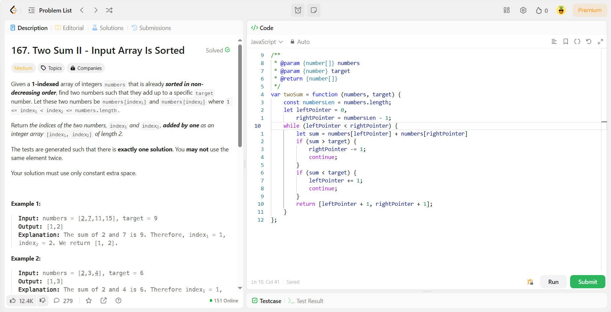
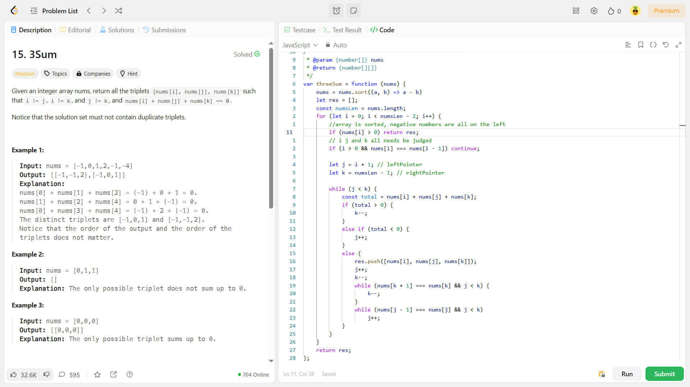
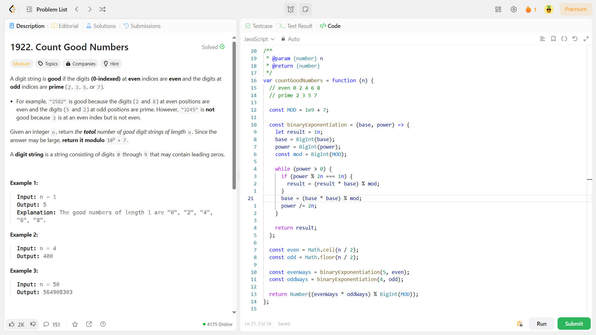
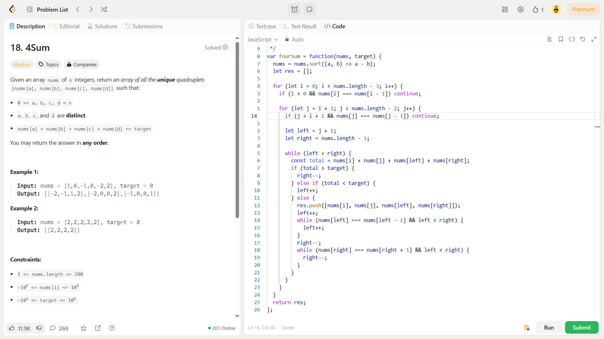
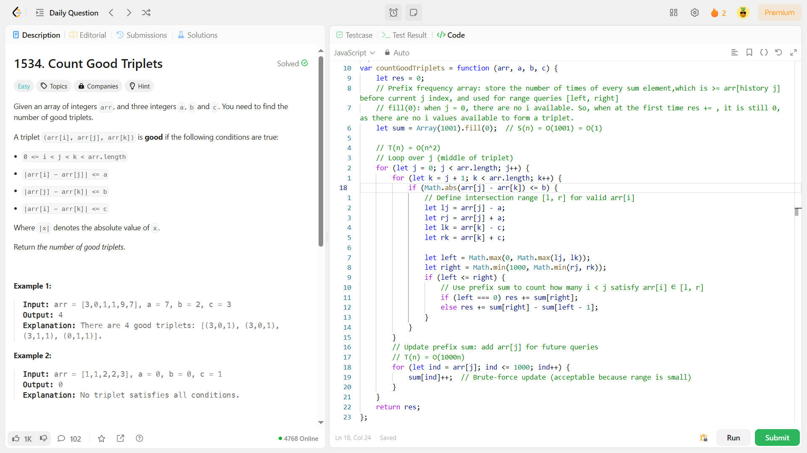
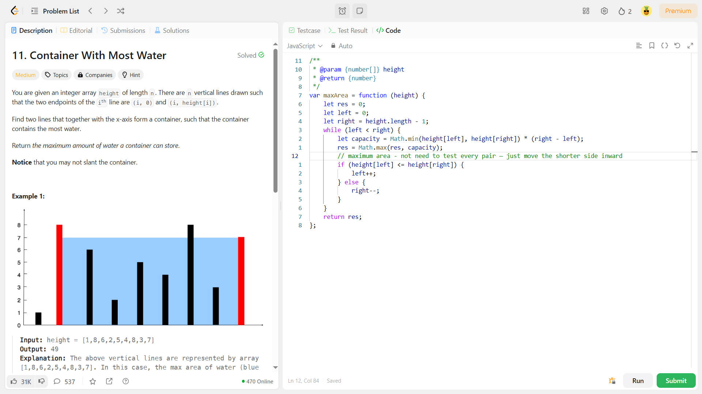
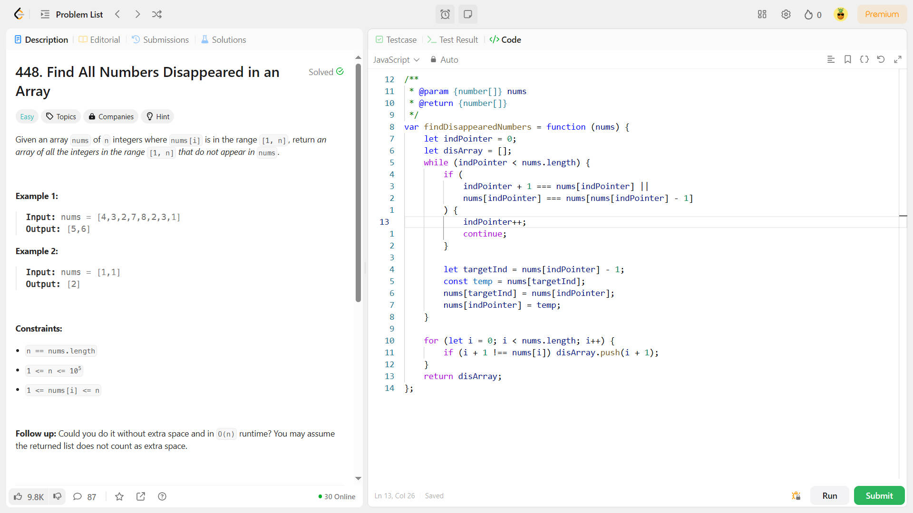
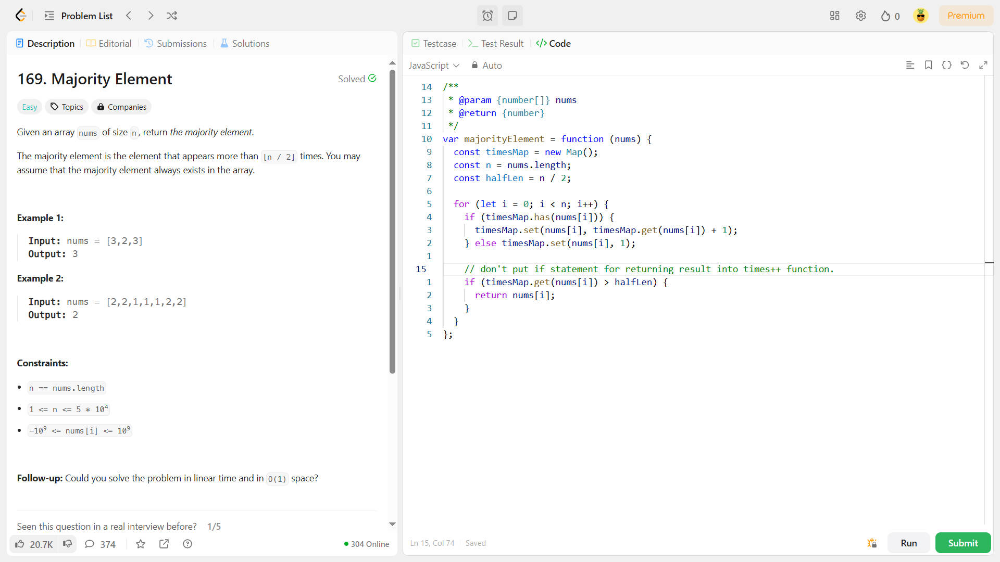
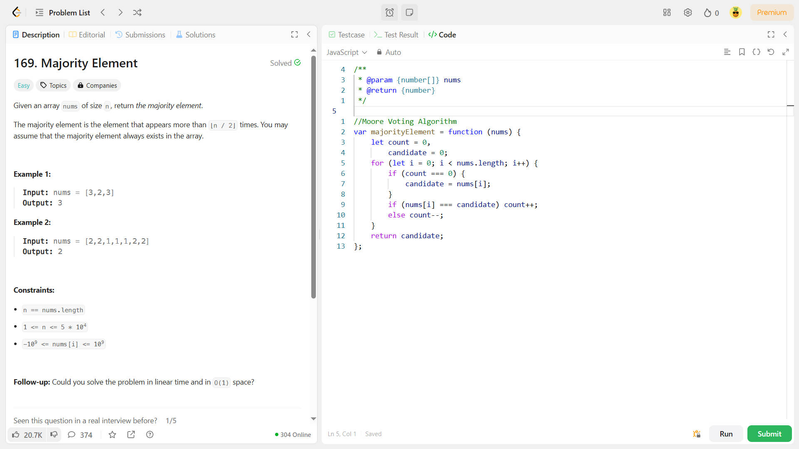
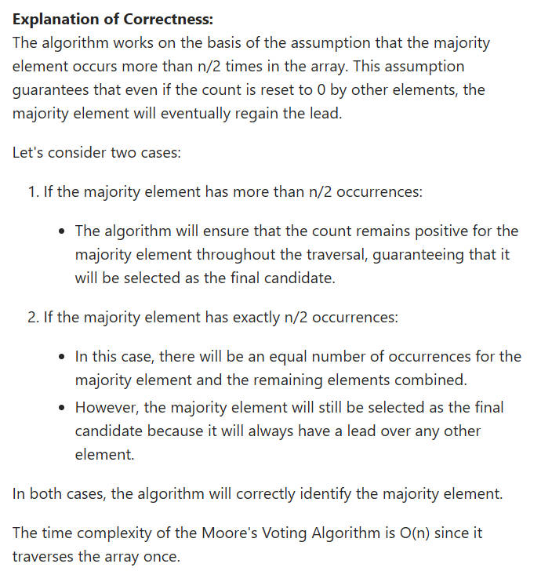

# Day1

Two Pointers

&nbsp;

# Day2

Sort + Two Pointer

&nbsp;

# Day3

Modular Exponentiation - binary exponentiation

&nbsp;

# Day4

Sort + Two Pointer
_a kSum solution - focus on a generalized implementation_

&nbsp;

Prefix Sum

&nbsp;

# Day5

Two Pointer

&nbsp;

# Day6

In-Place Hash + In-Place Swapping

---

&nbsp;

Hash

&nbsp;

★Moore Voting Algorithm

